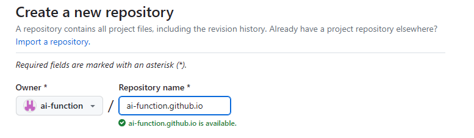
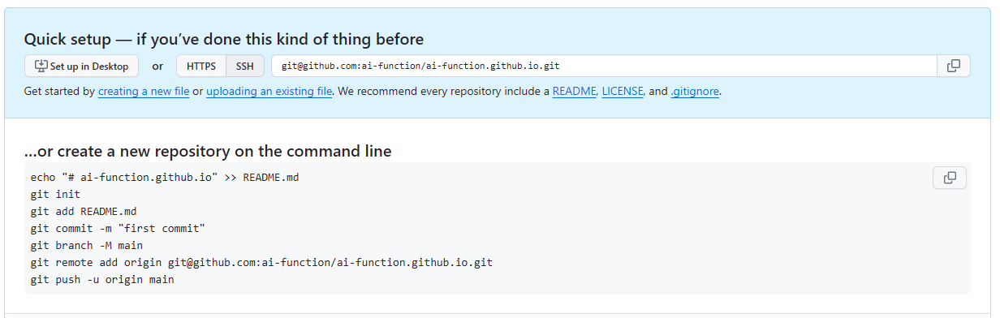
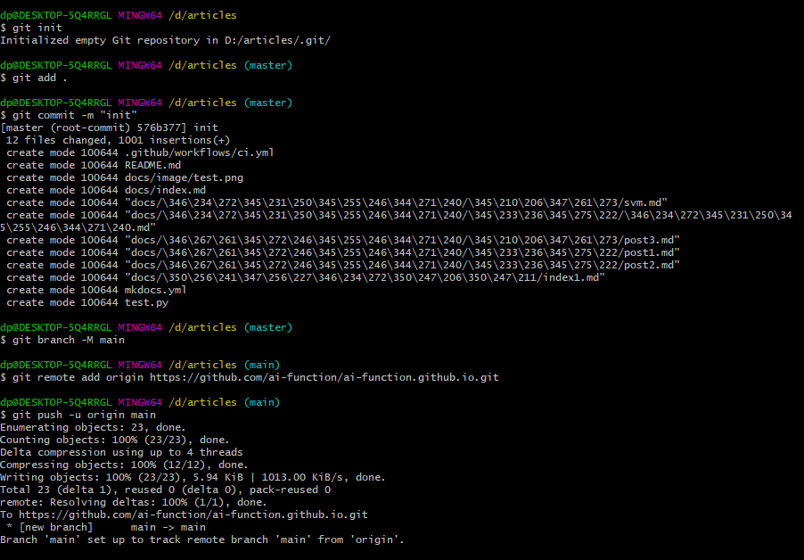
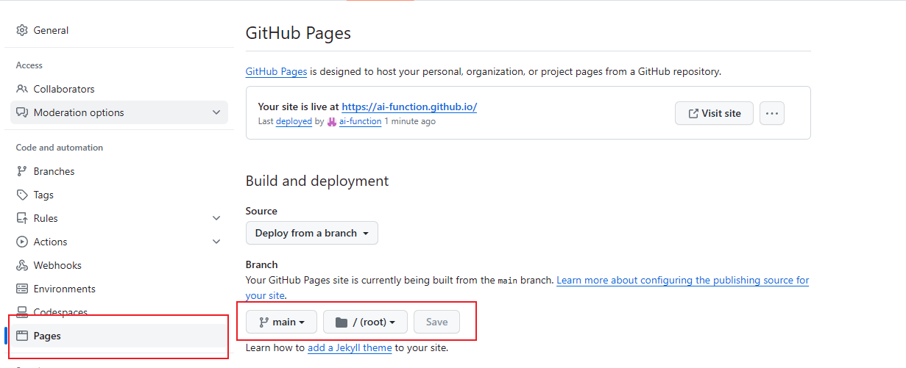
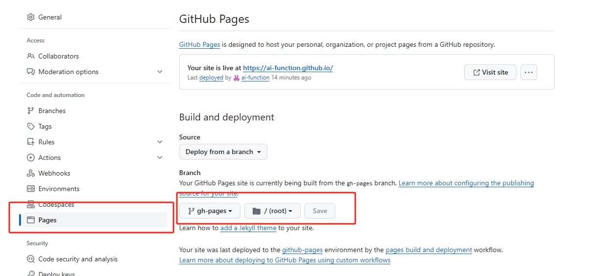
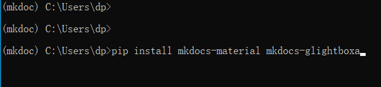
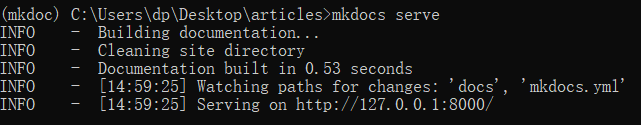

---
tags:
  - HTML5
  - JavaScript
  - CSS
comments: true
---

# 首页

1. [模板下载](./zip/articles.zip "模板")
2. github 中创建代码仓

3. 在模板目录下，将代码推送到代码仓中

4. 启用 github page，将 main 设置成 gh-pages

5. 安装依赖项目，并在本机上测试

参考链接：
1. https://docs.github.com/zh/pages/getting-started-with-github-pages/creating-a-github-pages-site

2. https://docs.github.com/zh/pages/getting-started-with-github-pages/configuring-a-publishing-source-for-your-github-pages-site

3. https://www.mkdocs.org

### 测试

插入图片：

